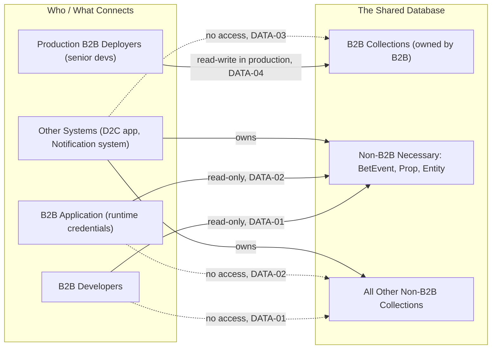
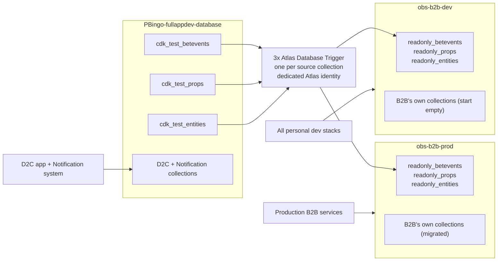

# HLD: B2B / Non-B2B Data Access Isolation

**Status:** Draft — requirements defined, implementation approach not yet chosen.

## Context

The B2B platform's data lives in the same MongoDB Atlas cluster and, today, the same database as two other systems: the D2C mobile app and a Notification system. This was surfaced while designing personal developer stacks for the B2B platform (see [`spec/infra/environments.spec.md`](../../spec/infra/environments.spec.md)) and confirmed directly against the live Atlas project — every service credential currently in use (B2B's ECS task roles, the Notification system's Lambda roles, and several engineers' personal accounts) holds broad, database-wide `readWrite` or `readAnyDatabase`/`readWriteAnyDatabase` access, with one partial exception. Nothing today enforces that a credential scoped to one application can't reach another's data.

This HLD defines what "correctly isolated" means for this shared database, independent of which specific migration or access-control mechanism eventually implements it. A follow-up spec will define the implementation; see "Next Steps" below.

## Definitions

- **The shared database** — the single MongoDB database (`PBingo-fullappdev-database` today) that the B2B application, the D2C mobile app, and the Notification system all currently use. Whether isolation is achieved by access control within this database, a physically separate mirror, or something else is an implementation choice, not part of this HLD.
- **B2B collections** — the set of collections in the shared database whose schema is owned and evolved by the B2B application: `B2BOrganization`, `B2BContest`, `B2BPrizeTier`, `B2BBoard`, `B2BUser`, `B2BTestObject`. Defined by **ownership**, not by current naming — these are physically prefixed `cdk_test_*` today, which is itself flagged for cleanup (see [`known-issues.md`](../POC-baseline/known-issues.md)). If that prefix changes, this definition doesn't.
- **Non-B2B collections** — every other collection in the shared database: the D2C mobile app's collections (`Contest`, `User`, `Board`, `Prop`, `BetEvent`, `Entity`, `PromoCode`, and others), and the Notification system's collections (`notifications`, `comments`, `notificationtemplates`, and others). These are owned by systems other than B2B and — per existing, unrelated constraint — the D2C models among them cannot be modified.
- **B2B-necessary non-B2B collections** — the specific subset of non-B2B collections the B2B application actually needs to read to function: **`BetEvent`, `Prop`, `Entity`**. Confirmed directly against the B2B codebase (every B2B read path that touches non-B2B data touches exactly these three, always via `.find()`/`.populate()`, never a write) — not assumed.

## Requirements

**`DATA-01` — B2B developers get read-only access to B2B-necessary non-B2B collections, nothing else non-B2B.**
A developer whose access is scoped to the B2B application must have no write access to any non-B2B collection, and read access limited to exactly the B2B-necessary non-B2B collections (`BetEvent`, `Prop`, `Entity`). No access — read or write — to any other non-B2B collection.

**`DATA-02` — The B2B application's own runtime credentials get read-only access to B2B-necessary non-B2B collections, nothing else non-B2B.**
Distinct from `DATA-01` — this covers the application's own service credentials (task roles, function execution roles), not human developers. They must have read-only access to the B2B-necessary non-B2B collections, and full read-write only on B2B collections. How that read access is provided — scoped access to the live collections, a replica, a periodic mirror, or something else — is an implementation decision, not part of this requirement.

**`DATA-03` — Systems other than the B2B application cannot access B2B collections.**
No credential belonging to another system (the D2C mobile app, the Notification system, or any future consumer) may read or write B2B collections. This holds regardless of how B2B collections are named, structured, or physically located — it's defined against the ownership boundary in "Definitions" above, not against today's naming.

**`DATA-04` — Write access to B2B collections in production is restricted to production deployers.**
Only whoever is authorized to deploy the production B2B application may have write access to B2B collections in production. This is a smaller, more senior tier than general B2B developer access (`DATA-01`) — most B2B developers should not, by default, be able to write to production B2B data at all.

## Access Diagram

Solid arrows are permitted access; dashed arrows are explicitly denied. Each is labeled with the requirement it comes from.

`DEV` and `APP` have no drawn edge to `B2B` here deliberately — this HLD doesn't make a claim about general B2B-developer or runtime access to B2B collections in *this* (shared/production) database; `DATA-04` only constrains who may write there. Read/write access to B2B collections in a non-production context is covered by [`environments.spec.md`](../../spec/infra/environments.spec.md), not this document.

## Current State vs. These Requirements

All four requirements are currently violated. Full detail in [`known-issues.md`](../POC-baseline/known-issues.md); summarized:

- B2B's own service roles hold database-wide `readWrite`, not scoped to `DATA-02`'s three collections (or away from other systems' data).
- The Notification system's service roles (two of three) hold database-wide `readWrite`, which includes B2B collections — violates `DATA-03`.
- Several engineers hold project-wide `readWriteAnyDatabase`/`readAnyDatabase` access — violates `DATA-01` and, if any hold both dev and prod access under one identity, `DATA-04`.
- There is currently no production B2B deployment distinct from the single existing stack, so `DATA-04`'s "production deployers" tier doesn't exist yet as a concept — it needs to be defined alongside the prod release process (an open question already noted in `environments.spec.md`).

## Chosen Approach: Continuous Replication via Atlas Database Triggers

**Decision (2026-08):** rather than production reading the shared database's necessary collections directly (as an earlier draft of this HLD implied), both production and personal dev stacks read from their own continuously-replicated mirror. This removes *both* environments' service credentials from the shared database entirely — only the replication mechanism itself ever touches it.

### Databases and Clusters — Exactly What Gets Created

| Item | Action |
|---|---|
| Atlas cluster `PBingo-dev` | **No change.** Reused — no new cluster. |
| Atlas project `PB-dev` | **No change.** Reused — no new project. (A fully separate Atlas project for dev was considered; database-level separation plus the trigger identity being the only cross-boundary credential achieves the same isolation without it. Revisit if the number of systems sharing this project grows.) |
| Database `PBingo-fullappdev-database` | **Remains the live source** for the D2C app, Notification system, and `PbCdkMonoRepo` — unchanged for them. B2B's own collections **move out** of it (see below). |
| Database `obs-b2b-prod` | **New.** On the existing `PBingo-dev` cluster. Holds B2B's own collections (migrated) **plus** a continuously-replicated read-only mirror of the three necessary collections. The only database production B2B services connect to. |
| Database `obs-b2b-dev` | **New.** On the existing `PBingo-dev` cluster. Same shape; B2B collections start empty, mirror is replicated the same way. The only database personal dev stacks connect to — one shared mirror for all developers, not one per developer. |

**Why B2B's own collections move rather than staying put:** B2B code populates across the boundary (`B2BContest.allowedBetEvents` → `BetEvent`, and all nine `B2BBoard` positions → `Prop`). Mongoose does not perform cross-database populate automatically, so B2B's collections and the mirrored collections must live in the same database or that code breaks. Moving them is cheap — B2B's production data is small (24 boards, 16 users at time of writing) — and it has a significant side benefit: once B2B collections are in their own database, `DATA-03` is satisfied structurally (other systems' credentials are scoped to `PBingo-fullappdev-database`, which no longer contains any B2B data) rather than by per-collection permission rules.

### Replication Architecture

The trigger's Atlas identity is the *only* credential in the design that reads the source collections. It is scoped to exactly: read on those three collections, write on the two mirror databases — nothing else. Configured directly in Atlas (not CDK) since Atlas Triggers are an Atlas-managed product.

Note the three arrows that **don't** exist: production B2B services never connect to `PBingo-fullappdev-database`; personal dev stacks never connect to anything but `obs-b2b-dev`; and the D2C app and Notification system have no path to B2B data at all, because B2B data no longer lives in the database they're scoped to.

### Still Open

- Exact Atlas permission configuration for the trigger identity — defined in Atlas directly.
- `DATA-04`'s prerequisite (an `obs-b2b-prod-deployers` group) — still doesn't exist.
- Collection **renaming** *is* bundled into this move: the `cdk_test_` stage prefix is dropped, B2B's collections take bare names (`organizations`, `boards`, …), and replicas take a `readonly_` prefix. See the implementation spec for the naming conventions and the (small, D2C-safe) `pb-shared-deps` changes required.

## Next Steps

Implementation — naming conventions, exact collection placement, trigger configuration, Atlas roles, and the cutover sequence — is specified in [`spec/core-modules/2-approved/mongodb-access-isolation.spec.md`](../../spec/core-modules/2-approved/mongodb-access-isolation.spec.md).

Once that lands, `DATA-01`, `DATA-02`, and `DATA-03` are satisfied structurally (by which database each credential can reach) rather than by per-collection permission rules. `DATA-04` still needs its `obs-b2b-prod-deployers` group to exist.

## Related

- [`spec/infra/environments.spec.md`](../../spec/infra/environments.spec.md) — personal dev stack design; this HLD grew out of designing that
- [`documents/POC-baseline/known-issues.md`](../POC-baseline/known-issues.md) — current-state access-control gaps this HLD's requirements address
- PRD [`SEC-08`](../PRD/OBS_B2B_Platform_PRD.md) — baseline hardening requirement this design supports
