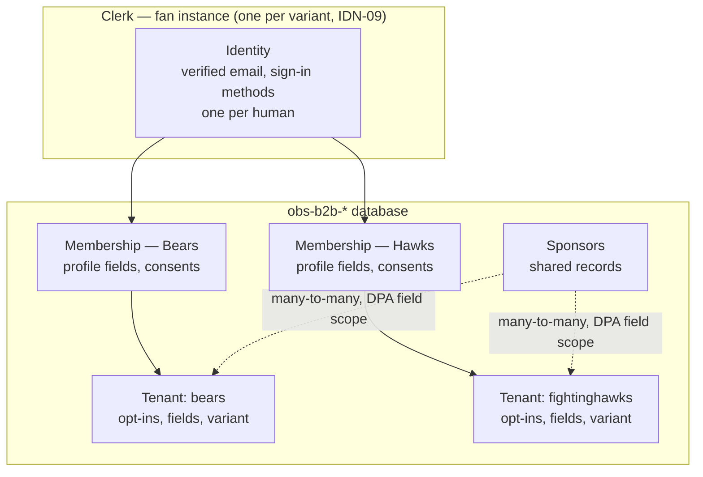
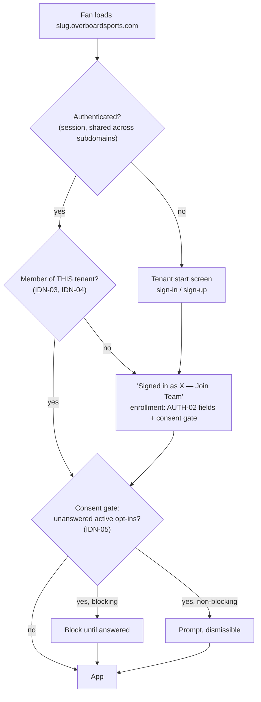

# HLD: Multi-Tenant Identity, Authentication & Consent

**Status:** Draft — model agreed 2026-08, implementation approach not yet specified.

## How to Read This Document

Requirements carry a priority tag:

| Tag | Meaning |
| --- | --- |
| **[P0]** | Required. The model does not hold without it. |
| **[P2]** | Suggested where technically feasible for reasonable effort. May be dropped if it adds great complication. |

`IDN-` IDs are stable references for specs, tickets, and tests.

## Context

The B2B platform serves many tenants from one codebase at `[slug].overboardsports.com`. Each tenant's fans sign up, consent to that tenant's opt-ins, and play. The PRD treats signup and auth as a single tenant-local flow (`AUTH-01`–`AUTH-04`, `OPT-01`–`OPT-06`), which holds only while no fan ever belongs to two tenants. That assumption breaks the first time one person is a fan of two teams on the platform — a normal case, not an edge case.

Three independently-true facts collide:

1. **`B2BUser.clerkUserId` is uniquely indexed** (`obs-b2b-shared/src/models/b2b.ts`), so one Clerk identity can belong to exactly one tenant, forever. The same schema carries a compound unique on `{email, organizationId}`, written as though the same email *should* span tenants. The two constraints contradict each other.
2. **Clerk enforces email uniqueness per instance.** Two users cannot share an email address within one Clerk instance.
3. **Clerk production instances share sessions across subdomains of one root domain by default.** This is intended behavior, not a setting, and it remains true in the target state. `bears.overboardsports.com` and `fightinghawks.overboardsports.com` are one session.

Traced through the current code, a fan who signed up at Bears and later opens the Hawks app arrives already authenticated (3); `ProtectedRoute` checks only `isSignedIn` and admits them; the contest list is fetched with a **client-supplied** `organizationId` that no middleware validates against membership; and they play a Hawks activation **having never been shown Hawks' opt-ins**. That last step bypasses `OPT-02` and `SEC-03` silently — the precise thing a sponsor's legal review exists to catch.

This document defines the identity, membership, consent, and administrative-access model. It does not specify the migration or the API surface; see "Next Steps."

## Definitions

- **Identity** — the platform-wide record of a human being, held in Clerk. One per person within a Clerk instance, keyed by verified email. Spans every tenant on that instance.
- **Membership** — the record of one identity's relationship to one tenant: their per-tenant profile field values (`AUTH-02`), their consent decisions, and their join date. A fan has one membership per tenant they have joined. This is the record that today's `B2BUser` conflates with identity.
- **Join** — the explicit act that creates a membership. Distinct from authentication. An authenticated fan with no membership at the tenant they are visiting has not joined it.
- **Entry** — any load of a tenant's app by an authenticated fan. Not just sign-in; sessions are long-lived and entry recurs.
- **Consent gate** — the check, run at every entry, comparing the tenant's currently-active opt-ins against the fan's recorded decisions for that tenant.
- **Opt-in version** — the revision of an opt-in's user-facing text. Changing the text mints a new version; prior decisions no longer satisfy it.
- **Fan surface** — `[slug].overboardsports.com`. Consumer-facing, high volume, no MFA.
- **Admin surface** — the internal/tenant/reporting UI (`TEN-05`). Low volume, privileged, MFA-enforced. Does not exist yet; build begins ~September 2026.
- **Actor classes on the admin surface** — **OBS staff** (cross-tenant) and **team users** (one tenant; the "designated tenant user" of `PRIZE-03`). Sponsors receive exports but do not authenticate (`IDN-11`).

## Requirements

**`IDN-01` [P0] — One identity per human, platform-wide.**
A verified email address identifies exactly one person across the platform. Signing in at any tenant with that email resolves to the same identity. Two tenants' fan records for the same email refer to the same person, not to two coincidentally-similar people. This holds within a Clerk instance; `IDN-09` describes the one deliberate exception.

**`IDN-02` [P0] — Email is the identity join key, regardless of sign-in method.**
Every fan carries a verified email whatever method their tenant offers. This restates PRD `AUTH-03` and states its consequence: `AUTH-03` is not only a prize-delivery requirement, it is the key that makes `IDN-01` true. A tenant collecting phone and not email would produce two unlinkable records for one human and silently break the identity model. Any future proposal to relax `AUTH-03` for signup conversion must be evaluated against this, not only against `PRIZE-01`.

**`IDN-03` [P0] — Membership is per tenant and always explicit.**
Holding a valid session is never sufficient to access a tenant. A fan accesses a tenant only through a membership created by a deliberate join. Because sessions are shared across subdomains by design (Context, fact 3), "is authenticated" and "may be here" are permanently different questions and must be answered by different mechanisms.

**`IDN-04` [P0] — Tenant scope is derived server-side, never supplied by the client.**
The tenant for a request is derived from the request's host and validated against the caller's memberships by middleware. Handlers receive tenant and membership as established facts. Any handler accepting an `organizationId` from a query string, body, or path is by definition a defect.

*Why this is P0:* `IDN-03` and `IDN-05`–`IDN-07` are enforced by the client. If the server accepts a client-supplied tenant, a fan who never joined a tenant and never saw its opt-ins can still read that tenant's data by calling the API directly — the consent gate is bypassed not by attack but by not using the website. Every per-tenant consent guarantee in this document rests on `IDN-04`. It is also what makes the isolation question answerable in a sponsor security review (`SEC-08`): a middleware function to point at, rather than "the frontend is careful." If `IDN-04` is ever dropped, `IDN-05`–`IDN-07` should be dropped with it and the platform should stop claiming per-tenant consent, rather than retain requirements the architecture cannot enforce.

**`IDN-05` [P0] — Consent is evaluated at entry, not collected once at signup.**
The consent gate runs on every entry, comparing the tenant's active opt-ins for the entry context against the fan's recorded decisions. The gate's **context is a parameter**: in V1 it is the tenant; narrowing it to tenant-plus-game satisfies `OPT-06` with no change to the mechanism.

**`IDN-06` [P0] — Consent is tenant-scoped and never transfers between tenants.**
A fan's acceptance of a Coca-Cola opt-in at one tenant grants nothing at another tenant, even for the identical sponsor. The DPA is between the sponsor and that team.

**`IDN-07` [P0] — Consent records store a decision and a text version.**
Each record is `(membership, optInId, textVersion, decision, agreedAt)` where decision is accepted or declined. Storing only acceptances re-prompts a declining fan on every entry forever; storing no version makes an `OPT-05` text change undetectable. Both are required for `IDN-05` to function.

**`IDN-08` [P0] — Account deletion is membership-scoped by default.**
A deletion request at one tenant removes that membership and its tenant-scoped data, propagated per `SEC-06`. The platform identity is deleted only when the last membership is gone. A documented support path exists for full cross-tenant erasure.

**`IDN-09` [P2] — Sign-in method is a product variant, constant per tenant per season.**
`AUTH-04` anticipates tenants wanting different primary sign-in methods (one email-primary, another phone-primary). This is satisfied by **two fan Clerk instances — one email-primary, one phone-primary — sold to teams as variants**, with a tenant's choice fixed for the duration of a season. It is not a per-request config lookup and is not exposed in the admin UI.

Two consequences to hold explicitly:

- **The count is per variant, not per tenant.** Two fan instances exist regardless of whether there are five tenants or fifty. `TEN-03`'s onboarding budget and `TEN-C1`'s prohibition on per-tenant code are preserved: onboarding a tenant selects a variant, it does not provision infrastructure.
- **`IDN-01` holds within an instance, not across the two.** A fan of a phone-primary team *and* an email-primary team has two identities that cannot be linked. This is accepted. It is invisible to any fan who follows teams on one variant, and it is the reason `IDN-09` is P2 rather than P0 — the simplification is real but it buys a genuine limitation.

**`IDN-10` [P0] — Administrative access is MFA-enforced and separated from fan access at the Clerk instance boundary.**
`SEC-08` requires MFA-enforced administrative access. Clerk's "Require multi-factor authentication" is a **single instance-wide toggle** applying to every user of that instance; it cannot be scoped to a subset. Since MFA cannot be imposed on the fan population, the admin surface requires its own Clerk instance with the toggle on. Organization membership mode is likewise instance-wide, and the two surfaces need opposite settings (see "Admin Surface").

Scoping MFA to only those routes that export or delete fan PII was considered and rejected on a mechanism detail: Clerk's reverification (step-up auth) **silently downgrades a requested `multi_factor` check to `first_factor` when the user has no second factor enrolled**. Gating PII routes therefore does not deliver MFA unless second-factor enrollment is separately enforced — which is the instance-wide toggle again. Since only a small number of designated people ever hold admin accounts, requiring MFA of all of them is the simpler and more defensible position.

**`IDN-11` [P0] — Sponsors are data relationships, not authenticated actors, in V1.**
Sponsor↔tenant is a many-to-many relationship in the database carrying the DPA field scope (`RPT-04`). Sponsors receive exports; they do not sign in. PRD `TEN-04` is satisfied by a single shared sponsor record linked to many tenants — it requires **no revision**, and per-tenant duplication of sponsor records is what it exists to prevent.

**`IDN-12` [P0] — Admin scope is derived from organization membership, never supplied by the client.**
The same principle as `IDN-04`, applied to the admin surface.

**`IDN-13` [P2] — Sensitive admin actions require reverification.**
Export or deletion of fan PII prompts the operator to re-verify within an MFA'd session, using Clerk's reverification with a short window. This is step-up value independent of `IDN-10` — it narrows the blast radius of an unattended authenticated session on the highest-consequence actions.

## Agreed Case Behavior

### Identity

| Case | Behavior |
|---|---|
| Same email signs up at a second tenant | Do not error. Detect the existing identifier, route to sign-in, then to the join flow. |
| Already signed in at tenant A, lands on tenant B | **Not treated as signed in to B.** B's start screen shows "You're signed in as `<email>` — Join `<Team>` →" plus "Not you? Sign out." Joining runs the enrollment step: B's configured fields (`AUTH-02`, prefilled where possible) and B's consent gate. |
| Password at one tenant, Google at another, same email | Clerk account linking merges them — correct under `IDN-01`. The join flow still runs for the second tenant. Requires explicit testing, since `AUTH-01` puts Google at launch. |
| Same person, different emails per tenant | Two identities. Accepted and undetectable by design. |
| Fan is on both a phone-primary and an email-primary tenant | Two identities, unlinkable. Accepted consequence of `IDN-09`. |
| **[P2]** Fan changes their email | `B2BUser.email` is a denormalized cache used for prize delivery. Sync on Clerk's `user.updated` webhook and retain the cache — `PRIZE-01` requires sends within seconds, so a live Clerk lookup on the send path is the wrong trade. The existing prize-delivery construct already prefers Clerk with a `B2BUser` fallback; the webhook makes that fallback authoritative. |

### Membership and consent

| Case | Behavior |
|---|---|
| Existing fan joins a second tenant | Authentication and enrollment are separate steps. Today they are fused into one signup form; separating them is the structural change this HLD requires. |
| Same sponsor active at two tenants the fan belongs to | Consent does not transfer (`IDN-06`). The fan answers that sponsor's opt-in once per tenant. |
| Tenant changes its ToS or sponsor consent text | New `textVersion`; the gate re-prompts on next entry (`IDN-05`, `IDN-07`). |
| Sponsor added mid-season | The gate finds an unanswered active opt-in and prompts for that gap only. This is `OPT-06`, obtained free from `IDN-05` rather than built separately. |
| Fan declines a non-blocking opt-in | Decision recorded as declined against that version. Not re-prompted until the version changes. |
| "Delete my account" at one tenant | Membership-scoped (`IDN-08`). |
| **[P2]** Tenant offboards | Memberships and tenant-scoped data archive or purge; the identity survives if other memberships remain. |

### Session and routing

One rule covers this class: **tenant comes from the hostname, session answers who you are, membership answers whether you may be here.** Three separate questions, three separate mechanisms. This is what makes two tabs on two subdomains work simultaneously, and what makes a prize-email deep link into tenant B behave correctly while signed in as A.

## Identity Model

One identity, many memberships. The identity lives in Clerk; everything tenant-scoped lives in the database next to the tenant config it depends on.

## Entry Flow

Every load of a tenant app resolves through the same three questions.

The gate at `F` is the mechanism that covers first join, tenant switching, ToS revision, and mid-season sponsor addition with one piece of code.

## Clerk Organizations for Fan Membership: The Case Both Ways

Fan↔tenant membership could be modelled as Clerk Organizations rather than as a database join. This was considered seriously; the decision is to use the database, but the argument is close enough to record properly rather than dismiss.

### The case for Clerk Organizations

- **One mechanism instead of two.** The admin surface uses Organizations regardless (`IDN-10`). Using them for fans too means one membership model, one set of primitives, one thing to learn — rather than Clerk orgs for staff and a bespoke join table for fans.
- **Tenant scope becomes cryptographically bound to the session.** `orgId` arrives inside a signed JWT rather than being derived from a host header. That is a genuinely stronger `IDN-04` story: the tenant claim cannot be forged by a client at all, versus a host header that middleware must be trusted to read correctly and consistently on every route.
- **Membership CRUD is free.** Join, leave, list-my-tenants, and the associated API surface are Clerk's rather than ours to build and secure.
- **Room to grow.** If fan tiers ever appear (season-ticket holders, VIP access, tenant-side moderators), roles and invitations already exist rather than needing to be invented.

### The case against, and why it wins

- **Clerk's active organization is a single value per session.** A fan with two tenant tabs open has one active org across both — the tabs contend, and the wrong tenant's scope can be applied to the visible page. Multi-tab is ordinary consumer behavior, not an edge case. It also forces a `choose-organization` interstitial, which is precisely wrong for a fan arriving at their team's branded page expecting to play. *This is the decisive objection.*
- **It splits one relationship across two systems.** Consent records (`IDN-07`), `AUTH-02` per-tenant field values, and gameplay data must live in the database next to the tenant config that defines them. Membership is the parent record of all three. Putting the parent in Clerk and the children in Mongo puts a transaction boundary and a sync problem through the middle of a single concept — and consent is the part that has to be provably correct.
- **It makes a core domain concept a vendor dependency.** "Which fans belong to which tenant" is the business. Migrating it later, if Clerk's pricing, limits, or org semantics move against us, is a far harder exit than migrating authentication alone.
- **Scale and pricing.** Clerk's free allowance is 100 monthly-retained organizations with up to 20 members each; a single team's fan base exceeds it, and beyond it lies the B2B add-on plus per-organization fees. *Listed last deliberately — this is not a reason to decide, only a cost to be aware of. The decision should be made on the multi-tab and source-of-truth arguments and would be the same if the pricing were free.*

**Net:** the JWT-bound scope is a real advantage given up, and `IDN-04` exists to recover it — host-derived scope validated server-side against a membership lookup reaches the same guarantee with more code. The multi-tab failure has no equivalent workaround, and the source-of-truth split lands on the consent data specifically, which is the data that must survive legal scrutiny. Database join table.

Clerk Organizations remain correct for the admin surface, where volumes are small, invitations and RBAC come free, and single-active-organization semantics match real context switching.

## Admin Surface

Build begins ~September 2026. Fan-side design must not foreclose it; the two surfaces are separate Clerk instances and share no session.

**Separate instance with MFA required** (`IDN-10`), for three reasons: MFA is an instance-wide toggle and cannot be required of fans; organization membership mode is instance-wide and the surfaces need opposite settings (admin `Membership required`, fans personal accounts); and admin sign-in should be locked down rather than inheriting the fan variants' method config. The cost is one additional JWKS issuer for the backend to trust — acceptable, since `/admin/*` warrants a distinct middleware chain from `/b2b/*` regardless.

**Organization topology.** Two kinds, tagged by `publicMetadata.kind`:

| Kind | Count | Members | Grants |
|---|---|---|---|
| `tenant` | one per team, slug matching the tenant slug | that team's designated users | that tenant only |
| `obs` | exactly one | OBS staff | cross-tenant |

OBS staff hold membership in the single `obs` organization rather than admin membership in every tenant organization. Both approaches satisfy `RPT-05`'s requirement that the internal fan-actions export be inaccessible to team users — the alternative does so via custom roles (`org:obs_staff` vs `org:team_admin`), which works and is operationally cheap. The `obs` organization is preferred because Clerk's active organization is a single per-session value: `OBS-03`'s cross-tenant health dashboard and `RPT-01`/`RPT-02`'s cross-tenant trends have no single active org that authorizes them, whereas membership in one `obs` organization is a standing cross-tenant grant. The two are alternatives, not complements; adding staff to every tenant organization *as well* grants nothing further.

No sponsor organizations (`IDN-11`).

Note the deliberate asymmetry with the fan surface: single-active-organization semantics are wrong for fans and right for staff.

## Current State vs These Requirements

| Requirement | State | Evidence |
|---|---|---|
| `IDN-01` | Violated | `clerkUserId` uniquely indexed — one identity can hold one tenant only |
| `IDN-03` | Violated | A session is treated as authorization. `ProtectedRoute` checks `isSignedIn` alone, so a session held for one tenant admits the fan to every tenant. Session sharing across subdomains is not the defect and persists in the target state; the defect is that nothing checks membership afterwards. |
| `IDN-04` | Violated | `organizationId` arrives as a client-supplied query parameter, unvalidated against membership. Also an open IDOR independent of multi-tenancy — already logged in `known-issues.md`; `IDN-04` closes it. |
| `IDN-05` | Violated | Opt-ins collected once, inside the signup form |
| `IDN-07` | Violated | Worse than a version gap: `createB2BUser` accepts `optInConsents` but `b2bUserSchema` declares no such field, so Mongoose strips it. **Consent is discarded before persistence** — consistent with POC-baseline's `OPT-*` row. |
| `IDN-09` | Not built | One shared instance; no variant concept |
| `IDN-10`, `IDN-12`, `IDN-13` | Not applicable yet | Admin surface not built |
| `IDN-11` | Partially met | Sponsor↔tenant relationship exists in config; DPA field scope not modelled |

## Implied Changes

Not a specification — the shape the implementation spec must cover.

**Data model.** Split today's `B2BUser` into identity and membership. A `B2BFan` (Clerk user id, canonical email) and a `B2BFanMembership` (fan × tenant: profile field values per `AUTH-02`, consent records per `IDN-07`, joined-at) matches `AUTH-02`'s per-tenant field configuration and makes `IDN-08` a single-document delete. The minimum viable alternative — dropping `unique` on `clerkUserId` for a compound `{clerkUserId, organizationId}` — unblocks the identity case but leaves per-tenant profile data conflated with identity. Production holds tens of B2B user records at time of writing; the migration will not be cheaper later.

**Backend.** Middleware derives tenant from `Origin`/`Host`, resolves it, loads the caller's membership, and injects both. Handlers stop accepting tenant identifiers as input. The consent gate is evaluated server-side and returned with the membership, so the client cannot skip it. `optInConsents` gains a schema.

**Frontend.** `ProtectedRoute` gains a third state: authenticated but not a member of this tenant, routing to the join flow. A `useMembership()` accompanies `useTenant()`. The untyped `(window as any).Clerk?.session?.getToken()` in the RTK Query `prepareHeaders` becomes the typed `getToken()`.

## Still Open

- **`PRIZE-03` finalization authority** — whether team users may trigger contest finalization or only OBS staff. **Tabled.** Already an open question in PRD §11; it shapes the admin role set, and roles are inexpensive to add later.

## Superseded Guidance

`overboard-b2b-template/SOP-DEPLOYMENT.md` §4.1 instructs creating a **new Clerk application per tenant**. That is POC-era guidance and is superseded by `IDN-09`: fan Clerk instances exist per *variant*, not per tenant. The SOP is a POC-baseline artifact and should be read as a record of what was done, not as instructions — see [`documents/POC-baseline/README.md`](../POC-baseline/README.md) for that distinction.

## Out of Scope

- **`AUTH-04` D2C credential passthrough.** Not designed here. `IDN-01` is the precondition that would make it a single linking problem rather than one per tenant.
- **Just-in-time access to non-anonymized data.** Considered as an alternative to blanket admin MFA; unnecessary once `IDN-10` requires MFA on the admin instance, with `IDN-13` covering the highest-consequence actions.

## Related

- PRD [`AUTH-01`–`AUTH-04`, `OPT-01`–`OPT-06`, `TEN-04`, `SEC-03`, `SEC-06`, `SEC-08`, `RPT-04`, `RPT-05`](../PRD/OBS_B2B_Platform_PRD.md)
- [`documents/POC-baseline/webapp.md`](../POC-baseline/webapp.md) — current auth and tenant resolution
- [`documents/POC-baseline/known-issues.md`](../POC-baseline/known-issues.md) — the authorization gaps `IDN-04` closes
- [`documents/HLDs/data-access-isolation.md`](data-access-isolation.md) — the same server-side-scope principle at the database credential layer
