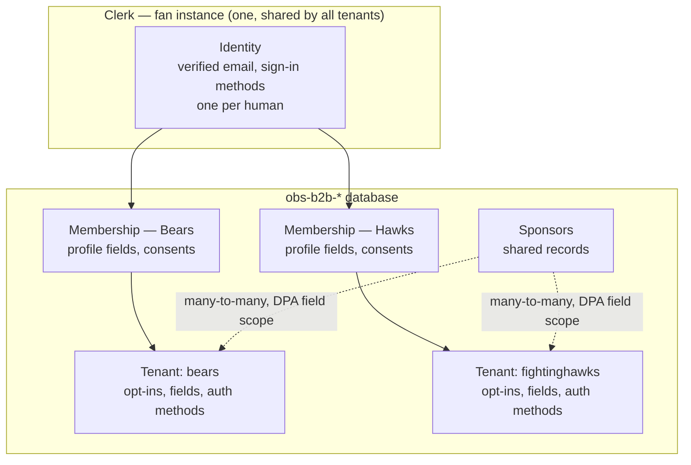
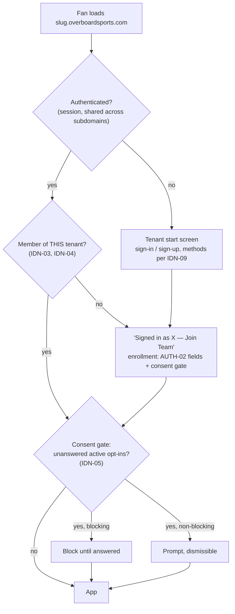

# HLD: Multi-Tenant Identity, Authentication & Consent

**Status:** Draft — model agreed 2026-08, implementation approach not yet specified.

## Context

The B2B platform serves many tenants from one codebase at `[slug].overboardsports.com`. Each tenant's fans sign up, consent to that tenant's opt-ins, and play. The PRD treats signup and auth as a single tenant-local flow (`AUTH-01`–`AUTH-04`, `OPT-01`–`OPT-06`), which holds only while no fan ever belongs to two tenants. That assumption breaks the first time one person is a fan of two teams on the platform — a normal case, not an edge case.

Three independently-true facts collide:

1. **`B2BUser.clerkUserId` is uniquely indexed** (`obs-b2b-shared/src/models/b2b.ts`), so one Clerk identity can belong to exactly one tenant, forever. The same schema carries a compound unique on `{email, organizationId}`, written as though the same email *should* span tenants. The two constraints contradict each other.
2. **Clerk enforces email uniqueness per instance.** Two users cannot share an email address within one Clerk instance.
3. **Clerk production instances share sessions across subdomains of one root domain by default.** This is intended behavior, not a setting. `bears.overboardsports.com` and `fightinghawks.overboardsports.com` are one session.

Traced through the current code, a fan who signed up at Bears and later opens the Hawks app arrives already authenticated (3); `ProtectedRoute` checks only `isSignedIn` and admits them; the contest list is fetched with a **client-supplied** `organizationId` that no middleware validates against membership; and they play a Hawks activation **having never been shown Hawks' opt-ins**. That last step bypasses `OPT-02` and `SEC-03` silently — the precise thing a sponsor's legal review exists to catch.

The current documentation compounds this: `SOP-DEPLOYMENT.md` §4.1 instructs creating a **new Clerk application per tenant**, while the code implements a **single shared instance** with subdomain slug resolution. The docs describe one architecture and the code implements a broken version of the other. Resolving that ambiguity is the purpose of this HLD.

This document defines the identity, membership, consent, and administrative-access model. It does not specify the migration or the API surface; see "Next Steps."

## Definitions

- **Identity** — the platform-wide record of a human being, held in Clerk. One per person, keyed by verified email. Spans every tenant that person interacts with.
- **Membership** — the record of one identity's relationship to one tenant: their per-tenant profile field values (`AUTH-02`), their consent decisions, and their join date. A fan has one membership per tenant they have joined. This is the record that today's `B2BUser` conflates with identity.
- **Join** — the explicit act that creates a membership. Distinct from authentication. An authenticated fan with no membership at the tenant they are visiting has not joined it.
- **Entry** — any load of a tenant's app by an authenticated fan. Not just sign-in; sessions are long-lived and entry recurs.
- **Consent gate** — the check, run at every entry, comparing the tenant's currently-active opt-ins against the fan's recorded decisions for that tenant.
- **Opt-in version** — the revision of an opt-in's user-facing text. Changing the text mints a new version; prior decisions no longer satisfy it.
- **Fan surface** — `[slug].overboardsports.com`. Consumer-facing, high volume, no MFA.
- **Admin surface** — the internal/tenant/reporting UI (`TEN-05`). Low volume, privileged, MFA-relevant under `SEC-08`. Does not exist yet; build begins ~September 2026.
- **Actor classes on the admin surface** — **OBS staff** (cross-tenant), **team users** (one tenant; the "designated tenant user" of `PRIZE-03`), and **sponsors** (reporting recipients — *not* authenticated users in V1; see `IDN-11`).

## Requirements

**`IDN-01` — One identity per human, platform-wide.**
A verified email address identifies exactly one person across the entire platform. Signing in at any tenant with that email resolves to the same identity. Two tenants' fan records for the same email refer to the same person, not to two coincidentally-similar people.

**`IDN-02` — Email is the identity join key, regardless of sign-in method.**
Every fan carries a verified email whatever method their tenant offers. This restates PRD `AUTH-03` and states its consequence: `AUTH-03` is not only a prize-delivery requirement, it is the key that makes `IDN-01` true. A tenant that collected phone and not email would produce two unlinkable records for one human and silently break the identity model. Any future proposal to relax `AUTH-03` for signup conversion must be evaluated against this, not only against `PRIZE-01`.

**`IDN-03` — Membership is per tenant and always explicit.**
Holding a valid session is never sufficient to access a tenant. A fan accesses a tenant only through a membership created by a deliberate join. Because sessions are shared across subdomains (Context, fact 3), "is authenticated" and "may be here" are different questions and must be answered separately.

**`IDN-04` — Tenant scope is derived server-side, never supplied by the client.**
The tenant for a request is derived from the request's host and validated against the caller's memberships by middleware. Handlers receive tenant and membership as established facts. Any handler accepting an `organizationId` from a query string, body, or path is by definition a defect.

**`IDN-05` — Consent is evaluated at entry, not collected once at signup.**
The consent gate runs on every entry, comparing the tenant's active opt-ins for the entry context against the fan's recorded decisions. The gate's **context is a parameter**: in V1 it is the tenant; narrowing it to the tenant-plus-game satisfies `OPT-06` with no change to the mechanism.

**`IDN-06` — Consent is tenant-scoped and never transfers between tenants.**
A fan's acceptance of a Coca-Cola opt-in at one tenant grants nothing at another tenant, even for the identical sponsor. The DPA is between the sponsor and that team.

**`IDN-07` — Consent records store a decision and a text version.**
Each record is `(membership, optInId, textVersion, decision, agreedAt)` where decision is accepted or declined. Storing only acceptances re-prompts a declining fan on every entry forever; storing no version makes a `OPT-05` text change undetectable. Both are required for `IDN-05` to work.

**`IDN-08` — Account deletion is membership-scoped by default.**
A deletion request at one tenant removes that membership and its tenant-scoped data, propagated per `SEC-06`. The platform identity is deleted only when the last membership is gone. A documented support path exists for full cross-tenant erasure.

**`IDN-09` — Sign-in method is per-tenant configuration, constant per tenant.**
Which methods a tenant offers, and which is primary, is a set-once onboarding config value in the manner of `BRAND-01` — not a code path, not a separate build, and not surfaced in the admin UI. This satisfies `AUTH-04`'s per-tenant method selection without per-tenant code (`TEN-C1`).

**`IDN-10` — Administrative access is separated from fan access at the Clerk instance boundary.**
`SEC-08` requires MFA-enforced administrative access. Clerk's "Require multi-factor authentication" is a **single instance-wide toggle** applying to every user of that instance; it cannot be scoped to a subset. Since MFA cannot be imposed on the fan population, the admin surface requires its own Clerk instance. Org membership mode is likewise instance-wide and the two surfaces need opposite settings (see "Admin Surface").

**`IDN-11` — Sponsors are data relationships, not authenticated actors, in V1.**
Sponsor↔tenant is a many-to-many relationship in the database carrying the DPA field scope (`RPT-04`). Sponsors receive exports; they do not sign in. PRD `TEN-04` is satisfied by a single shared sponsor record linked to many tenants — it requires no change, and per-tenant duplication of sponsor records is what it exists to prevent.

**`IDN-12` — Admin scope is derived from organization membership, never supplied by the client.**
The same principle as `IDN-04`, applied to the admin surface.

## Agreed Case Behavior

The cases this model exists to answer, with the behavior agreed 2026-08.

### Identity

| Case | Behavior |
|---|---|
| Same email signs up at a second tenant | Do not error. Detect the existing identifier, route to sign-in, then to the join flow. |
| Already signed in at tenant A, lands on tenant B | **Not treated as signed in to B.** B's start screen shows "You're signed in as `<email>` — Join `<Team>` →" plus "Not you? Sign out." Joining runs the enrollment step: B's configured fields (`AUTH-02`, prefilled where possible) and B's consent gate. |
| Password at one tenant, Google at another, same email | Clerk account linking merges them — correct under `IDN-01`. The join flow still runs for the second tenant. Requires explicit testing, since `AUTH-01` puts Google at launch. |
| Same person, different emails per tenant | Two identities. Accepted and undetectable by design; "one person" is knowable only to the extent email is shared. |
| Fan changes their email | `B2BUser.email` is a denormalized cache used for prize delivery. Sync on Clerk's `user.updated` webhook and retain the cache — `PRIZE-01` requires sends within seconds, so a live Clerk lookup on the send path is the wrong trade. The existing prize-delivery construct already prefers Clerk with a `B2BUser` fallback; that instinct is right, the webhook makes the fallback authoritative. |
| Phone-primary tenant, email already registered elsewhere | Expected to surface as an existing-identifier error routing to sign-in and then join — the path already designed. **Unverified; see "Still Open."** |

### Membership and consent

| Case | Behavior |
|---|---|
| Existing fan joins a second tenant | Authentication and enrollment are separate steps. Today they are fused into one signup form; separating them is the structural change this HLD requires. |
| Same sponsor active at two tenants the fan belongs to | Consent does not transfer (`IDN-06`). The fan answers that sponsor's opt-in once per tenant. |
| Tenant changes its ToS or sponsor consent text | New `textVersion`; the gate re-prompts on next entry (`IDN-05`, `IDN-07`). |
| Sponsor added mid-season | The gate finds an unanswered active opt-in and prompts for that gap only. This is `OPT-06`, obtained free from `IDN-05` rather than built separately. |
| Fan declines a non-blocking opt-in | Decision recorded as declined against that version. Not re-prompted until the version changes. |
| "Delete my account" at one tenant | Membership-scoped (`IDN-08`). |
| Tenant offboards | Memberships and tenant-scoped data archive or purge; the identity survives if other memberships remain. |

### Session and routing

One rule covers this class: **tenant comes from the hostname, session answers who you are, membership answers whether you may be here.** Three separate questions, three separate mechanisms. This is what makes two tabs on two subdomains work simultaneously, and what makes a prize-email deep link into tenant B behave correctly while signed in as A.

## Identity Model

One identity, many memberships. The identity lives in Clerk; everything tenant-scoped lives in the database next to the tenant config it depends on. Membership is deliberately **not** modelled as Clerk Organizations — see "Why Not Clerk Organizations for Fans."

## Entry Flow

Every load of a tenant app resolves through the same three questions.

The gate at `F` is the mechanism that covers first join, tenant switching, ToS revision, and mid-season sponsor addition with one piece of code.

## Admin Surface

Build begins ~September 2026. Fan-side design must not foreclose it; the two surfaces are separate instances and share no session.

**Separate Clerk instance** (`IDN-10`), for three reasons: MFA is an instance-wide toggle and cannot be required of fans; organization membership mode is instance-wide and the surfaces need opposite settings (admin `Membership required`, fans personal accounts); and admin sign-in should be locked down rather than inheriting per-tenant fan method config. The cost is one additional JWKS issuer for the backend to trust — acceptable, since `/admin/*` warrants a distinct middleware chain from `/b2b/*` regardless.

**Organization topology.** Two kinds, tagged by `publicMetadata.kind`:

| Kind | Count | Members | Grants |
|---|---|---|---|
| `tenant` | one per team, slug matching the tenant slug | that team's designated users | that tenant only |
| `obs` | exactly one | OBS staff | cross-tenant |

OBS staff hold membership in the single `obs` organization rather than admin membership in every tenant organization. Both approaches satisfy `RPT-05`'s requirement that the internal fan-actions export be inaccessible to team users — the alternative does so via a custom role (`org:obs_staff` vs `org:team_admin`), which works. The `obs` organization is preferred because Clerk's active organization is a single per-session value: `OBS-03`'s cross-tenant health dashboard and `RPT-01`/`RPT-02`'s cross-tenant trends have no single active org that authorizes them, whereas membership in one `obs` organization is a standing cross-tenant grant. The two mechanisms are alternatives, not complements; adding staff to every tenant organization *as well* grants nothing further.

No sponsor organizations (`IDN-11`).

Note the deliberate asymmetry with the fan surface: single-active-organization semantics are wrong for fans (two subdomain tabs at once) and right for staff (genuine context switching, served by `<OrganizationSwitcher />`).

## Why Not Clerk Organizations for Fans

Recorded because it is the obvious-looking answer and was considered.

- **Cost.** Clerk's free allowance is 100 monthly-retained organizations **with up to 20 members each**. A single team's fan base exceeds that. Beyond it lies the B2B Authentication add-on at $100/month plus per-organization fees — for a relationship already stored in the database.
- **Active organization is one value per session.** Two tabs on two tenant subdomains would contend over it, and it forces a `choose-organization` interstitial — exactly wrong for a fan arriving at their team's branded page.
- **Two sources of truth.** Fan↔tenant membership would live in Clerk while consent, `AUTH-02` field values, and gameplay data live in the database. The membership record is the parent of the consent record; splitting them across systems is the wrong seam.

Clerk Organizations remain correct for the admin surface, where volumes are small, invitations and RBAC come free, and context switching is real.

## Current State vs These Requirements

| Requirement | State | Evidence |
|---|---|---|
| `IDN-01` | Violated | `clerkUserId` uniquely indexed — one identity can hold one tenant only |
| `IDN-03` | Violated | `ProtectedRoute` checks `isSignedIn` alone; subdomain sessions are shared |
| `IDN-04` | Violated | `organizationId` arrives as a client-supplied query parameter, unvalidated |
| `IDN-05` | Violated | Opt-ins collected once, inside the signup form |
| `IDN-07` | Violated | `optInConsents` carries `{messageId, agreedAt}` — no version, acceptances only |
| `IDN-09` | Ambiguous | `SOP-DEPLOYMENT.md` §4.1 says one Clerk app per tenant; code uses one shared instance |
| `IDN-10`, `IDN-12` | Not applicable yet | Admin surface not built |
| `IDN-11` | Partially met | Sponsor↔tenant relationship exists in config; DPA field scope not modelled |

`IDN-04` is also an open IDOR independent of multi-tenancy: any authenticated fan can currently read any tenant's contests by changing a query parameter. Already logged in `known-issues.md`; recorded here because `IDN-04` closes it as a side effect.

## Implied Changes

Not a specification — the shape the implementation spec must cover.

**Data model.** Split today's `B2BUser` into identity and membership. A `B2BFan` (Clerk user id, canonical email) and a `B2BFanMembership` (fan × tenant: profile field values per `AUTH-02`, consent records per `IDN-07`, joined-at) matches `AUTH-02`'s per-tenant field configuration and makes `IDN-08` a single-document delete. The minimum viable alternative — dropping `unique` on `clerkUserId` for a compound `{clerkUserId, organizationId}` — unblocks the identity case but leaves per-tenant profile data conflated with identity. Production holds tens of B2B user records at time of writing; the migration will not be cheaper later.

**Backend.** Middleware derives tenant from `Origin`/`Host`, resolves it, loads the caller's membership, and injects both. Handlers stop accepting tenant identifiers as input. The consent gate is evaluated server-side and returned with the membership, so the client cannot skip it.

**Frontend.** `ProtectedRoute` gains a third state: authenticated but not a member of this tenant, routing to the join flow. A `useMembership()` accompanies `useTenant()`. Sign-in method selection reads tenant config (`IDN-09`). The untyped `(window as any).Clerk?.session?.getToken()` in the RTK Query `prepareHeaders` becomes the typed `getToken()`.

**Documentation.** `SOP-DEPLOYMENT.md` §4.1 is rewritten — one shared fan instance, not one per tenant.

## Still Open

- **MFA scope on the admin surface.** `IDN-10` establishes the separate instance; it does not settle whether team users are subject to MFA alongside OBS staff. Because the toggle is instance-wide, the options are: MFA for all admin users (simplest, defensible in a sponsor security review, since a team user triggering `PRIZE-03` finalization is administrative access to production data); or the instance toggle off with application-level enforcement checking `twoFactorEnabled` for `obs` organization members (hand-rolled security on the highest-privilege path). Decision required before the admin build starts.
- **Just-in-time access to non-anonymized data.** Preferred posture over a standing permission — an audited request/approval flow rather than a role check. Materially more to build; a role check is expected to carry V1.
- **`PRIZE-03` finalization authority.** Whether team users may trigger contest finalization or only OBS staff. Already an open question in PRD §11; it shapes the admin role set, though roles are inexpensive to add later.
- **Phone sign-up against an already-registered email.** Behavior when a phone-primary tenant's sign-up supplies an email belonging to an existing identity. Expected to route to sign-in and then join; requires a spike before phone auth ships to a live tenant. SMS per-message cost and Clerk's country allowlist also need sizing.
- **`AUTH-04` D2C credential passthrough.** `IDN-01` is the precondition that makes it a single linking problem rather than one per tenant. Not designed here.

## Next Steps

An implementation spec covering the data-model migration, the middleware contract, the consent gate's evaluation and storage, and the join flow's UX. The admin surface warrants its own spec once the MFA question above is settled.

## Related

- PRD [`AUTH-01`–`AUTH-04`, `OPT-01`–`OPT-06`, `TEN-04`, `SEC-03`, `SEC-06`, `SEC-08`, `RPT-04`, `RPT-05`](../PRD/OBS_B2B_Platform_PRD.md)
- [`documents/POC-baseline/webapp.md`](../POC-baseline/webapp.md) — current auth and tenant resolution
- [`documents/POC-baseline/known-issues.md`](../POC-baseline/known-issues.md) — the authorization gaps `IDN-04` closes
- [`documents/HLDs/data-access-isolation.md`](data-access-isolation.md) — the same server-side-scope principle at the database credential layer
